# Vanguard-Alpha v2.0 - System Architecture

This document provides a detailed overview of the Vanguard-Alpha v2.0 system architecture. The design emphasizes modularity, scalability, and a clear separation of concerns, making it suitable for institutional-grade applications.

---

## 1. Architectural Principles

- **Modularity**: Each component has a single, well-defined responsibility.
- **Integration**: Components are designed to work together seamlessly through clear interfaces.
- **Scalability**: The architecture can be scaled horizontally (e.g., by running components as separate microservices).
- **Testability**: Each module can be tested independently.
- **Resilience**: The system is designed to be fault-tolerant and to handle extreme market conditions gracefully.

---

## 2. High-Level Architecture Diagram

The following diagram illustrates the main components and the flow of data between them:

```mermaid
graph TD
    subgraph Data Ingestion
        A[Live Data Feed] -- Tick Data (Price, Volume) --> B
    end

    subgraph Core Logic
        B(🧠 Trading Brain)
        C[🤖 Advanced AI Engine] -- AI Signal (Buy/Sell/Hold) & Confidence --> B
        H[📊 Feature Engineering] -- 20+ Features --> B
        I[📈 Market State Machine] -- Market State (e.g., Trending, Volatile) --> B
    end

    subgraph Execution & Risk
        B -- Proposed Trade --> D{🛡️ Pro Risk Engine}
        D -- ✅ Approved Trade --> E[🔌 Execution Service]
        D -- ❌ Rejected Trade --> B
    end

    subgraph Persistence & Monitoring
        E -- Trade Confirmation --> F(💾 Database)
        B -- System & Market State --> F
        G[👁️ Real-time Monitor] -- Monitors --> B
        G -- Monitors --> E
        G -- Monitors --> F
    end

    style B fill:#f9f,stroke:#333,stroke-width:2px
    style C fill:#ccf,stroke:#333,stroke-width:2px
    style D fill:#f99,stroke:#333,stroke-width:2px
    style G fill:#9cf,stroke:#333,stroke-width:2px
```

---

## 3. Core Component Breakdown

### 3.1. `trading_brain.py`

- **Role**: The central orchestrator (Master Orchestrator) of the entire system.
- **Key Sub-components**:
    - **Feature Engineering Layer**: Extracts over 20 meaningful features from raw market data.
    - **Market State Machine**: Dynamically identifies the market regime (e.g., `TRENDING_UP`, `HIGH_VOLATILITY`).
    - **Pro Risk Engine**: The system's primary defense, performing 9 critical pre-trade checks.
- **Responsibilities**:
    - Receives market data.
    - Coordinates with all other components to form a trading decision.
    - Manages the overall state and flow of the application.

### 3.2. `advanced_ai_engine.py`

- **Role**: The predictive and decision-making core.
- **Key Sub-components**:
    - **Transformer Predictor**: A deep learning model that analyzes sequences of market features to predict future price movements.
    - **PPO Agent**: A reinforcement learning agent that takes the Transformer's prediction and the current market state to decide on the optimal action (Buy, Sell, or Hold).
    - **Large Replay Buffer**: Stores up to 200,000 experiences for efficient training.
- **Responsibilities**: Provides a high-confidence trading signal to the Trading Brain.

### 3.3. `pro_backtesting_engine.py`

- **Role**: Provides robust, out-of-sample validation of trading strategies.
- **Key Methods**:
    - **Walk-Forward Analysis**: Mitigates overfitting by training on one period and testing on the subsequent, unseen period in a rolling fashion.
    - **Monte Carlo Simulation**: Assesses risk and the distribution of potential outcomes by running thousands of simulations on trade results.
- **Responsibilities**: Calculates advanced performance metrics like Sharpe Ratio, Sortino Ratio, and Calmar Ratio.

### 3.4. `stress_test_monitor.py`

- **Role**: Ensures system resilience and provides operational transparency.
- **Key Sub-components**:
    - **Stress Tester**: Simulates 5 extreme scenarios (e.g., flash crash, high latency, liquidity crisis) to verify the Risk Engine's responses.
    - **Real-time Monitor**: A background service that tracks key performance indicators (KPIs) like PnL, equity, and drawdown, and issues alerts.

### 3.5. `integrated_system.py`

- **Role**: The main application entry point that integrates all components.
- **Responsibilities**: 
    - Initializes all system modules.
    - Provides a user-facing menu to run different modes (live trading, backtesting, stress testing).
    - Manages the main application lifecycle.

---

## 4. Data and Decision Flow

The end-to-end process for a single trade decision is as follows:

1.  **Data Acquisition**: A **tick** (live price/volume) arrives at the **Trading Brain**.
2.  **Feature Engineering**: The Brain's **Feature Engineer** calculates 20+ technical and market features.
3.  **State Analysis**: The **Market State Machine** analyzes these features to determine the current market state (e.g., `TRENDING_UP`).
4.  **AI Signal Generation**: The Brain requests a signal from the **Advanced AI Engine**, which uses its Transformer and PPO models to generate a `BUY`, `SELL`, or `HOLD` signal with a confidence score.
5.  **Risk Assessment**: The Brain forms a proposed order and sends it to the **Pro Risk Engine**, which performs its 9 critical checks.
6.  **Execution**: If the trade is approved by the Risk Engine, the order is sent to the **Execution Service** to be placed with the broker.
7.  **Persistence & Monitoring**: The final trade confirmation and current system state are logged to the **Database**. The **Real-time Monitor** observes this entire process.

---

## 5. Design Patterns & Principles

- **Strategy Pattern**: The AI Engine and its internal models can be swapped out, allowing for different trading strategies without changing the core architecture.
- **Orchestrator Pattern**: The Trading Brain acts as a central orchestrator, decoupling components and managing complex workflows.
- **State Pattern**: The Market State Machine uses the State design pattern to alter the system's behavior based on the market context.
- **Separation of Concerns**: Each module has a distinct responsibility, making the system easier to maintain, test, and scale.

---

## 6. Performance & Scalability

- **Optimization**: The system leverages vectorized operations with NumPy and Pandas for high-performance feature calculation. The AI engine is optimized to run on a GPU (if available) for faster training and inference.
- **Scalability**: The modular design allows for future deployment as a set of containerized microservices (e.g., using Docker and Kubernetes), enabling individual components to be scaled independently.

---

*This document reflects the architecture of Vanguard-Alpha v2.0. For previous versions, please refer to the commit history.*
