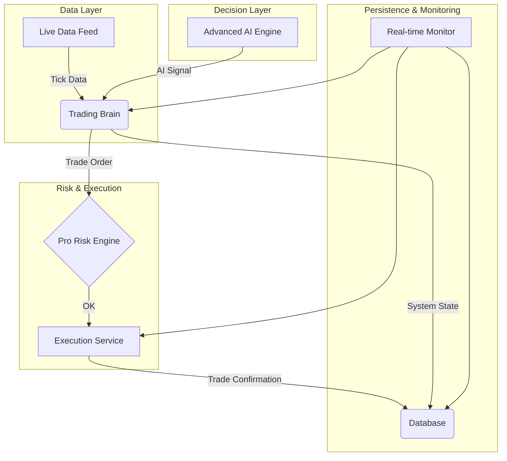

# Vanguard-Alpha v2.0 - Institutional Grade AI Trading System

**Vanguard-Alpha v2.0** is an institutional-grade, fully integrated, and AI-powered trading system designed for professional performance and reliability. This version represents a quantum leap from its predecessor, incorporating a sophisticated architecture, advanced machine learning models, and a robust risk management framework.

---

## ✨ Key Features

| Feature | Description |
|:---|:---|
| **🧠 Trading Brain** | A master orchestrator that centralizes decision-making, risk management, and state analysis. |
| **🤖 Advanced AI Engine** | Utilizes a **Transformer** model for price prediction and a **PPO (Proximal Policy Optimization)** agent for decision-making. |
| **🛡️ Pro Risk Engine** | Implements **9 critical pre-trade checks**, including latency, drawdown, and rate limiting. |
| **📊 Feature Engineering** | Extracts over **20 advanced features**, including momentum, volatility, and volume indicators. |
| **📈 Pro Backtesting** | Features **Walk-Forward Analysis** and **Monte Carlo Simulation** for robust strategy validation. |
| **🔬 Stress Testing** | Includes **5 critical stress test scenarios** to ensure system resilience under extreme market conditions. |
| **👁️ Real-time Monitoring** | Provides a live dashboard with alerts and performance tracking. |
| **🔌 Modular & Integrated** | All components are designed to work together seamlessly in a fully integrated system. |

---

## 🏗️ System Architecture

The system is built on a modular, microservice-ready architecture that separates concerns and enhances scalability.



For a detailed architecture diagram and explanation, see **[ARCHITECTURE.md](ARCHITECTURE.md)**.

---

## 🚀 Quick Start

### 1. Clone the Repository
```bash
git clone https://github.com/hab2025/Vanguard-Alpha.git
cd Vanguard-Alpha
```

### 2. Create Virtual Environment & Install Dependencies
```bash
# Create a virtual environment
python -m venv venv

# Activate it
source venv/bin/activate  # On Windows, use `venv\Scripts\activate`

# Install all required packages
pip install -r requirements.txt
```

### 3. Configure the System (Optional)
API keys for live trading are configured in `trading_brain.py` within the `SystemConfig` dataclass. For paper trading, you can use the default Alpaca URL.

### 4. Run the Integrated System
```bash
python integrated_system.py
```

You will be presented with a menu to choose between:
1.  **Run Stress Tests**
2.  **Run Live Trading (Simulated)**
3.  **Run Backtest**
4.  **Show System Status**
5.  **Exit**

---

## ⚙️ Project Structure

```
Vanguard-Alpha/
├── .github/                  # GitHub templates
├── v2_upgrade/               # Staging for new components
├── __init__.py
├── integrated_system.py      # << MAIN ENTRY POINT (v2.0)
├── trading_brain.py          # << Core orchestrator (v2.0)
├── advanced_ai_engine.py     # << Transformer + PPO (v2.0)
├── pro_backtesting_engine.py # << Walk-forward + MC (v2.0)
├── stress_test_monitor.py    # << Stress tests & monitoring (v2.0)
├── requirements.txt          # System dependencies
├── README.md                 # This file
├── ARCHITECTURE.md           # System architecture details
├── logs/                     # Log files
├── results/                  # Output results (e.g., charts)
└── ... (other documentation files)
```

---

## 🤝 Contributing

Contributions are welcome! Please read our **[CONTRIBUTING.md](CONTRIBUTING.md)** for guidelines on how to submit pull requests, report issues, and suggest features.

---

## 📄 License

This project is licensed under the MIT License. See the **[LICENSE](LICENSE)** file for details.

---

## ⚠️ Disclaimer

**IMPORTANT**: This system is for educational and research purposes only. It is **not** financial advice. Trading involves substantial risk of loss. Past performance is not indicative of future results. Always conduct your own research and consult with a financial advisor before trading with real capital.
